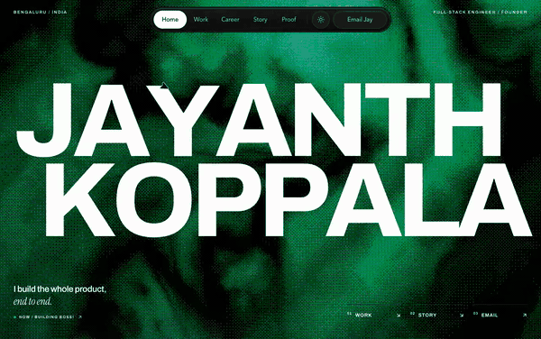

<div align="center">

# Jayanth Koppala — Portfolio

**Every claim on this site links to a receipt.**

[](https://jayanthkoppala.vercel.app)
[](https://nextjs.org)
[](https://www.typescriptlang.org)
[](https://tailwindcss.com)

<a href="https://jayanthkoppala.vercel.app">
  
</a>

<sub><a href="docs/demo.mp4">▶ Full walkthrough with sound (25s)</a> · <a href="https://jayanthkoppala.vercel.app">Open the live site</a></sub>

</div>

---

## What this is

My personal site. Full-stack engineer and founder, based in Bengaluru, currently building
[BOSS!](https://bosshq.in) — an AI hiring agent for India.

The site is built on one rule: **if I can't prove it, it doesn't go on there.** Every
number, win and role links out to a public source — an original post, a company registry
record, or a product you can open right now.

## Stack

| | |
|---|---|
| Framework | Next.js 16 (App Router, `output: "export"`) |
| Language | TypeScript |
| Styling | Tailwind CSS v4 — design tokens in `globals.css` |
| Motion | `motion`, Lenis smooth scroll |
| 3D / shaders | three.js (desk cube), OGL-based backgrounds |
| Hosting | Vercel |

18 runtime dependencies, no CSS framework beyond Tailwind, no component library —
the bespoke sections are hand-built.

## Running it

```bash
npm install
npm run dev      # dev server on :3000
npm run build    # static export to out/
npm run lint
npx serve out    # preview the exported build
```

Deploy: `vercel deploy --prod`.

## Layout

```
src/
  app/            layout, page, globals.css, icons
  components/     bespoke sections (Hero, Board, CareerIndex, ReceiptTweets, …)
    ui/           shadcn / Magic UI primitives
  config/         portfolio.ts — identity, about copy, contact strings
  data/           contributions.json (GitHub activity snapshot)
  lib/            shared helpers
  types/          career chapter shape
public/
  icons/tech/     skill chip SVGs, served locally
  images/         section artwork + receipt photos
  shots/          product screenshots used by the career chapters
```

## A few things I'd point out

**The career section is a machined instrument.** Seven companies as pressable keycaps
with their own LEDs, a display bay for the product shot, film grain and a
cursor-tracked specular sweep across the faceplate. Two finishes — gunmetal in dark
mode, aluminium in light — driven entirely by CSS variables scoped to
`.career-console`. It's a proper ARIA tablist: arrow keys, roving tabindex, real
`tabpanel`. On mobile the chapter opens directly beneath the key you tapped.

**Nothing is hotlinked.** Receipt images are downloaded into `public/images/receipts/`
rather than pointed at a third-party CDN, so the proof section can't break when
someone else's host changes.

**The proof deck advances itself** every six seconds and freezes the moment you hover,
focus or touch it — you never chase a moving target.

**Motion is opt-out everywhere.** Every animation on the page respects
`prefers-reduced-motion`.

## Elsewhere

[Site](https://jayanthkoppala.vercel.app) ·
[BOSS!](https://bosshq.in) ·
[X](https://x.com/JayBosshq) ·
[LinkedIn](https://www.linkedin.com/in/jayanth-koppala-71a8091b9/) ·
jay@bosshq.in

## License

Code is MIT. The content — copy, photographs, screenshots and the receipts — is mine;
please don't reuse it as your own.
